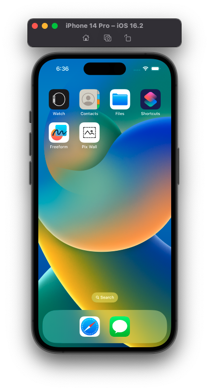
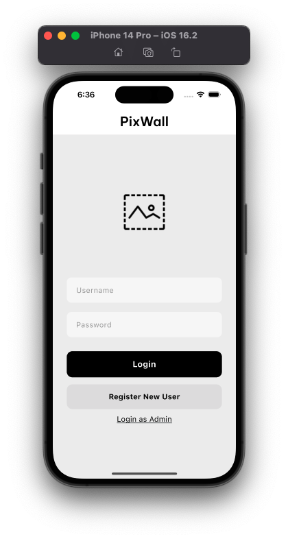
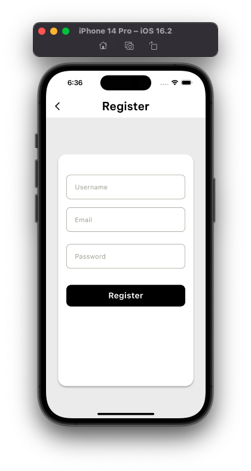

# PixWall

PixWall es una aplicación desarrollada en Flutter con un enfoque minimalista, diseñada para mostrar cómo consumir APIs, gestionar autenticación básica y trabajar con almacenamiento local y en la nube.

---

## Características Principales

- **Consumo de API:** Integración con [api.pexels.com](https://www.pexels.com/api/) para obtener imágenes de alta calidad.
- **Autenticación:** Implementación de autenticación básica mediante correo, nombre de usuario y contraseña.
- **Firebase Firestore:** Utilizado como base de datos para gestionar y almacenar datos de los usuarios y los wallpapers.
- **UploadThing:** Plataforma gratuita utilizada para el almacenamiento de wallpapers.
- **Sistema de Administrador:** Los administradores pueden subir wallpapers, organizarlos por categorías y gestionar el contenido.
- **Estilo Minimalista:** Interfaz limpia y enfocada en ofrecer una experiencia agradable al usuario.

---

## Previews

A continuación, se presentan capturas de pantalla de la aplicación:

| Pantalla 1 | Pantalla 2 | Pantalla 3 |
|------------|------------|------------|
|  |  |  |

---

## Configuración del Entorno

Para ejecutar esta aplicación, es necesario configurar un archivo `.env` con las siguientes variables:

```
API_KEY_PIXEL=<Tu clave API de Pexels>
UPLOADTHING_SECRET=<Tu clave secreta de UploadThing>
```

Asegúrate de reemplazar `<Tu clave API de Pexels>` y `<Tu clave secreta de UploadThing>` con tus credenciales respectivas.

---

## Cómo Ejecutar el Proyecto

1. Clona este repositorio:
   ```bash
   git clone <URL_DEL_REPOSITORIO>
   ```
2. Instala las dependencias:
   ```bash
   flutter pub get
   ```
3. Configura el archivo `.env` en el directorio raíz del proyecto.
4. Ejecuta la aplicación:
   ```bash
   flutter run
   ```

---

## Recursos Adicionales

- [Documentación de Flutter](https://docs.flutter.dev/)
- [API de Pexels](https://www.pexels.com/api/)
- [Firebase Firestore](https://firebase.google.com/products/firestore/)
- [UploadThing](https://uploadthing.com/)

---

## Licencia

Este proyecto es de código abierto y está disponible bajo la licencia [MIT](LICENSE).

---

¡Gracias por explorar PixWall! Si tienes preguntas o sugerencias, no dudes en abrir un issue en este repositorio.

